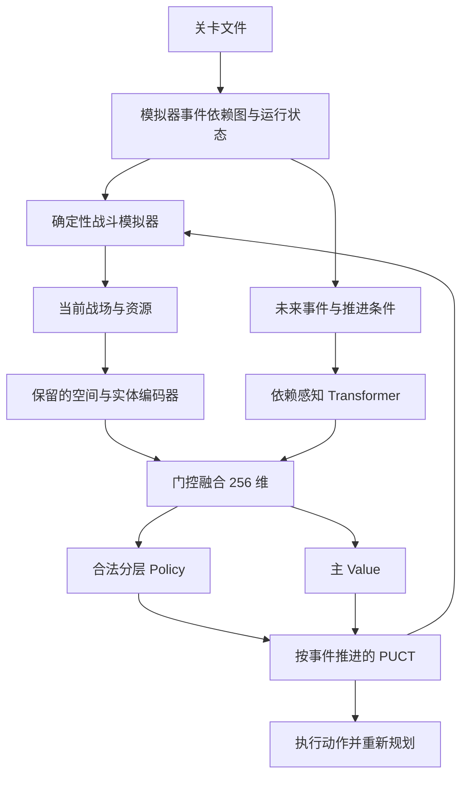

# 事件规划架构 v3：已保存，暂停待验证

2026-09-15。实际项目目录为 `/Users/yihao/Desktop/arkzero/神经网络`。本次先完成仓库审计和基线保存，再升级原有模拟器、训练系统、编队网络、PUCT 与桌面应用。没有建立分离的演示项目。

已完成两轮有界短训练、存档恢复和桌面自动部署验证。长期训练未启动。当前验证模型只能用于检查系统，尚不能称为高水平策略；两局短训练均为 0 击杀、11 漏怪，零漏怪通关率为 0。

## 审计与保留部分

[完整审计及修改方案](outputs/event_architecture/AUDIT_AND_PLAN.md) 包含旧网络逐层参数、Observation、动作、Policy/Value、Reward、调度方式、checkpoint 清单和修改文件计划。[审计前源码快照](outputs/event_architecture/baseline_source.zip) 与文件哈希清单已保留。

保留原地图/机制输入、96 通道空间卷积、原先两个残差块、干员/敌人编码、原融合结构、Value 目标、奖励 v2、合法性检查、物理 tick、伤害事件优先级、交替训练、课程训练和存档恢复流程。旧 checkpoint 均未覆盖。

## 实际架构

事件结构由 Simulator 提供：Wave/Fragment/Action、完成状态、生成与存活数量、依赖边、触发条件、精确时间或条件未知标志、路线几何、敌人属性，以及当前阻止推进的具体敌人。未来组不因尚未加入战斗队列而消失。网络不使用关卡或敌人 ID 词表记忆规则。

空间残差块从 2 个增加到 4 个，新块按恒等映射初始化。新增 FutureEventEncoder 为 2 层、128 维、4 个注意力头、512 维前馈层；每事件组 70 特征，10 类依赖关系，推进状态 32 特征。独立编码召唤物，敌人额外附带事件阻挡来源。保留原观测前缀和旧权重形状，以门控和归一化融合新上下文。自主编队也接收完整事件图。

| 参数量 | 修改前 | 修改后 |
|---|---:|---:|
| 战斗网络 | 1,114,210 | 2,402,492 |
| 编队网络 | 193,282 | 770,854 |
| 合计 | 1,307,492 | **3,173,346** |

所有模块及逐层权重形状、参数数量见 [逐层参数报告](outputs/event_architecture/PARAMETERS.md)。运行 `scripts/report_event_architecture.py` 可重新打印。

## 动作、搜索和长期目标

Policy 按合法前缀归一化：类型 → 干员/机关/召唤物 → 格子 → 方向，技能与撤退选择实体，等待选择时间方式。保留现有 9 种动作类型，增加默认下一事件 WAIT 之外的 0.5/1/2/5 秒等待。每层只比较合法子项，部署数量再多也不会自动获得更高的类型概率。

PUCT 默认从 8 个候选开始，按访问次数逐渐扩展。候选优先覆盖合法动作类型，探索时保留每个类型的总概率，再分配给当前已开放的具体动作。这样不会因部署分成数百个格子/方向，而让搜索只尝试五种 WAIT。完整动作身份和训练标签位置仍保留；公开 `top_k_actions` 仍严格按原始叶概率返回结果。候选限制降低实际展开数，当前网络仍计算完整合法动作概率。

`predict` 返回 policy、value、legal_actions、state_embedding，状态与骨干仅计算一次。环境提供 clone_state、step、fast_forward、get_next_decision_event、advance_to_next_decision_event、is_terminal、get_result 和 future_event_state。原有多节点 PUCT 已实际接入，Beam Search/MPC 可通过这些接口继续扩展，本次没有宣称实现它们。

保留奖励 v2：进度势函数为 `0.2×击杀比例−0.2×生命损失比例`；终局零漏怪额外 +0.6、普通 WIN +0.2、自然失败 −0.6。不按时间折扣，也不给伤害、DP、SP、等待或操作本身奖励。最终结果相同，早杀/晚杀的总回报相同，因此不会靠多等或重复撤退刷出奖励。截断对局不进入两网络训练。主 Value 预测剩余回报，范围为 [-1,1]，不解释成校准后的胜率。

拖怪必须通过原版允许的部署、撤退、留技能等行为实现。WAIT 会继续正常自动攻击，不提供不存在的停火能力。

## 验证结果

完整测试：**400 passed，66.08 秒**。升级前基线是 342 passed、2 failed；原有召唤物编码拒绝及同帧死亡测试问题已处理，并保留死亡取消攻击的正确优先级。

新增验证覆盖事件解析、完整依赖图、条件时间、无超时与有超时的区别、动作掩码、等待推进、触发条件、概率归一化、Value 范围、复制隔离、完整状态确定性、保存恢复、有限梯度和桌面控制。拖怪、留技能、提前部署、提前撤退、攒费用五个场景使用真实模拟器状态进行测试；证明机制与信息可表达这些取舍，不表示策略已学会。

0-1 的生成时间保持 `5、16、18、29、29.7、34、45、45.7、52、52.7、63.7` 秒，无部署结束时间保持 85.65 秒。确定性检查包含敌人/干员、DP/SP、事件进度、战斗结果与日志；限定为同一数据、设置和已验证运行环境。

真实短训练使用 [验证配置](configs/event_architecture_verification.yaml)：CPU 单线程、0-1、自主选 6 人、MCTS 4 次、两轮交替、每轮一局。第一轮战斗网络更新两次、编队不变；第二轮编队更新一次、战斗网络不变。130 条有效战斗回放，两个网络梯度有限且非零。恢复后两个模型、两个优化器、回放和相同状态的预测完全一致。

| 短训练 | 决策节点 | 物理 tick | WAIT | 部署 | 撤退 |
|---|---:|---:|---:|---:|---:|
| 战斗轮 | 130 | 5,139 | 113 | 9 | 8 |
| 编队轮 | 158 | 5,139 | 142 | 8 | 8 |

两局均自然结束、没有截断。普通 WIN 与零漏怪成功分开记录：0-1 允许剩余生命时结束为 WIN，因此漏 11 个敌人仍可能是普通 WIN；不能据此宣称模型表现好。尚存在无效部署/立即撤退，后续策略验证需重点检查。

真实桌面控件加载保存模型、自主编队、等待至费用满足后，由 AI 在 `(7,4)` 向左部署杜林，随后安全停止。显示波次、片段、未来生成条件、决策数和可解释日志。见 [桌面验证记录](outputs/event_architecture/runtime_verification.json) 与 [界面截图](outputs/event_architecture/desktop_verification.png)。

日志记录回报、两种胜率、漏怪、清关时间、动作占比、神经策略熵/搜索熵、各网络损失/梯度/优化次数，以及物理 tick 与决策节点。每次决策有当前事件、未来敌人/路线/条件、类型概率、候选、访问次数、Value 与最终选择。

## 性能与兼容

同机同设置、隔离进程中位数对比：推理 0.887→2.613 ms，编码 4.890→5.502 ms，batch=4 更新 9.815→25.014 ms，核心模拟 1732→969 模拟秒/墙钟秒，RSS 291→356 MiB。新架构增加了实际开销；完整事件 WAIT 对局为 387.5→395.6 ms。详见 [完整性能报告](outputs/event_architecture/PERFORMANCE.md) 和原始数据。

旧版已经按事件决策，本次增加片段边界后，无部署决策数从 133 变成 138，仍远少于 5139 tick；没有声称节点数进一步减少。完整事件注意力为平方复杂度，尚未做全地图压力测试。

| 实际旧 checkpoint 迁移 | 已加载参数 | 跳过参数 | 新参数 |
|---|---:|---:|---:|
| 战斗 v1 | 1,097,314 | 0 | 1,305,178 |
| 战斗 v2 | 1,114,210 | 0 | 1,288,282 |
| 编队 v1 | 96,002 | 0 | 674,852 |

迁移明确报告张量及部分扩展；原空间权重逐项验证相等。未知张量、不匹配形状、v3 缺失张量明确报错。旧优化器和旧观察回放不冒充新训练状态。见 [迁移明细](outputs/event_architecture/checkpoint_migration.json)。本次活动验证模型来自短训练，新架构没有冒充经过充分训练的旧模型。

## 已保存内容与后续验证

- [verification.pt](outputs/event_architecture/verification.pt)：桌面默认选择的双网络验证模型，标注“仅完成短训练”。
- [ready_to_resume.pt](outputs/event_architecture/ready_to_resume.pt)：完整训练状态，已停在第 2 轮完成后，无未完成对局。
- [短训练验证记录](outputs/event_architecture/smoke_verification.json)：权重更新、恢复断言和实际统计。
- [训练/回放日志目录](outputs/event_architecture/smoke)：真实对局、评估、各轮 checkpoint。
- [最终源码快照](outputs/event_architecture/source_snapshot.zip) 与 [哈希清单](outputs/event_architecture/saved_manifest.json)：用于后续验证和回退。审计前版本另行保存。

后续阶段保留现有训练流程：已有可信行为数据时先做行为学习；当前没有注入伪造示范。先验证基础操作与奖励，再用 `future_events_enabled` 做未来信息对照，以 `planner_enabled` 和搜索预算逐步启用规划。改变阶段开关需建立明确的新实验/权重热启动；完整 resume 会保留原实验开关，避免静默改变训练分布。不开 Planner 且没有外部标签时只是直接策略对照，不能宣称会自行产生新的策略改进标签。

本次多波、阻塞生成与超时规则有清晰实现和测试，但最大波次等待起点、postDelay 等仍需要实机逐帧校准。随机/隐藏分支、外部触发、阻塞剧情、未实现技能等继续明确拒绝或受原能力限制。原地图可运行范围没有擅自放开；本次完成的是事件规划架构第一版，不是所有地图与技能均已达到原版等价。

当前状态：**代码和 checkpoint 已保存；模拟已停止；长期训练暂停，等待用户验证。**
